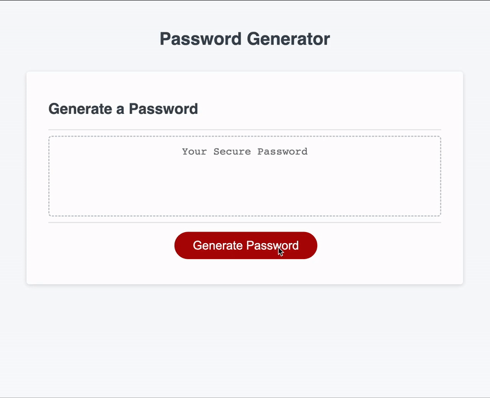
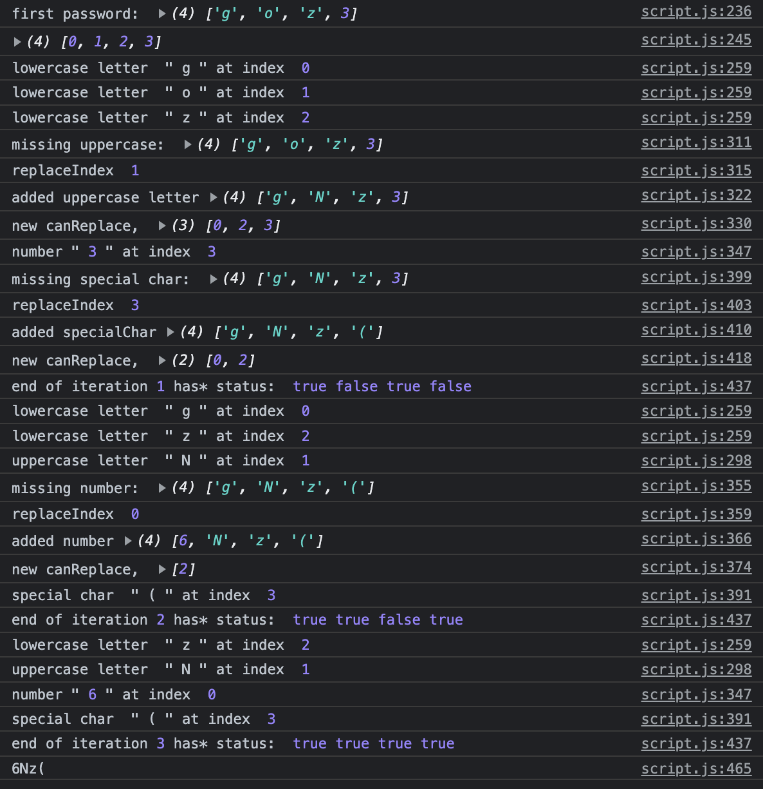

# Password Generator

## Description

This password generator was a big test of my JavaScript skills and was built based on the following acceptance criteria:

```
GIVEN I need a new, secure password
WHEN I click the button to generate a password
THEN I am presented with a series of prompts for password criteria
WHEN prompted for password criteria
THEN I select which criteria to include in the password
WHEN prompted for the length of the password
THEN I choose a length of at least 8 characters and no more than 128 characters
WHEN asked for character types to include in the password
THEN I confirm whether or not to include lowercase, uppercase, numeric, and/or special characters
WHEN I answer each prompt
THEN my input should be validated and at least one character type should be selected
WHEN all prompts are answered
THEN a password is generated that matches the selected criteria
WHEN the password is generated
THEN the password is either displayed in an alert or written to the page
```

I was challenged by many things during this project – the biggest hurdle being how to check and then iterate over a generated password to ensure it contained all the character types the user has selected. It was hours of getting nowhere, and then after that, hours of thinking I had solved it only to find in testing that it wasn't working the way I intended.

In the end, I have what feels to be like a robust password generator that I would be comfortable using in the real world.

The coolest part, in my opinion, actually didn't end up in the final code, which was the code I used to console log while troubleshooting. It really showed the mechanics of the generator in action, and seeing the password change character by character was super satisfying. Check out the screenshot in the Test section to see an example.


## Usage

The deployed password generator is located here: https://rhubarb414.github.io/challenge-03-password-generator/

Almost all the interaction takes place through JS prompts, where the user is asked to select the password criteria. Once the criteria is set and confirmed, the password is displayed on the page.

Here's a gif of the page in action:

 

## Credits

The HTML and CSS is purely from the UC Berkley Coding Bootcamp, while the password generating mechanics in the JS file are mine.

## License
See MIT license in repo. _Note that it only applies to the original Javascript lines and not to the code provided by the bootcamp._

## Tests
I spent a lot of time testing this app with variables set for debugging and many console logs. Here's a screenshot of the JS console during peak test phase. I was using 4 letter passwords with 4 different character types to maximize the chance I'd be missing one of the types:

